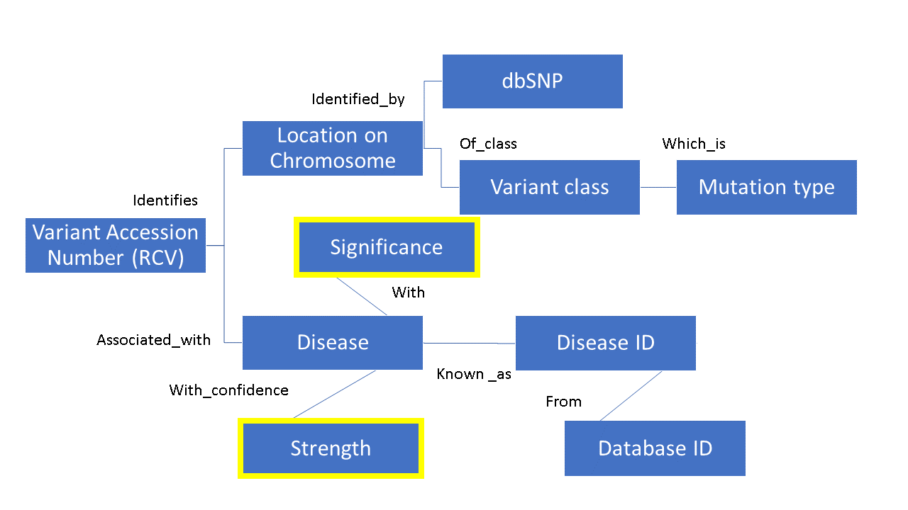
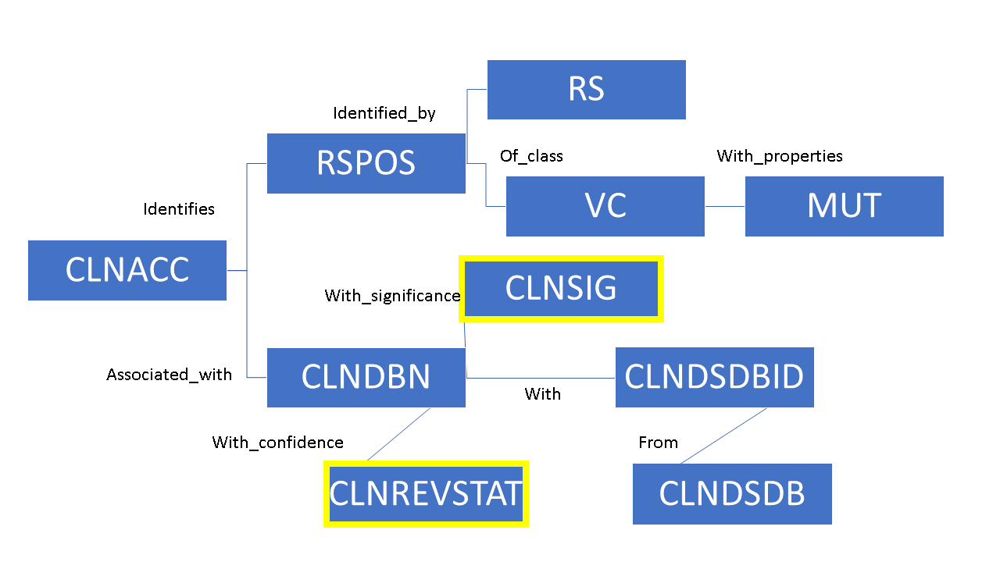

The ClinVar database (https://www.ncbi.nlm.nih.gov/clinvar/) is a public repository of submissions from researchers on the genetic variants known in the human genome, and their assocciated diseases. The whole database can be downloaded as one gzip file in several formats, including vcf and xml. While deeply informative, this database is currently best used only on the NCBI website, and the relationships between meta-data are unclear. The database is also continually updated, (some portions daily), and the new database files are updated monthly. Therefore, we also wanted clear documentation on what we did and why. This way the method could be repeated with the new version of the database, and strengthen the arguement for changing how the database is generate/released.

## Goals:
- Assess the FAIR qualities of the NCBI ClinVAR database according to the 15 FAIR principles
- Wrangle the database, and process using the FAIRifier (https://bioit.fair-dtls.surf-hosted.nl/fairifier/)
- Correct deficenies in the FAIRness of the database
- Create a relational scheme for the subjects (variables) in the file

## Pre-processing
We found that the main vcf file contains both the whole database (over 200,000 entries and 58 columns)
Since the metadata is incorporated into the file, we needed to trim the file to a proof of concept csv for FAIRizing,
while including the meta-data names as header names in the tsv file.

### Our initial FAIR assessment:
1. No Globally unique identifiers
2. Metadata and data in same file, therefore:
3. No metadata access when data is no longer available
4. Metadata doesn't use a broadly accessible language (assuming RDF was what was required)
5. Metadata using FAIR vocabularies - I don't think so.
6. Metadata doesn't have a complete versioning history but has some form of detailed provenance.
7. We question the, "metadata is richly described with a plurality of accurate and relevant attributes."

### TSV proof-of-concept file made using python

### FAIRification
We submited the tsv file to the fairifier

The CLNACC field, which is RCV#, was used to make a new column for the persistent ID like https://www.ncbi.nlm.nih.gov/clinvar/RCV000148988/

### Relational scheme
### 30,000 ft view
## Using common terms

## Using the metadata labels

We are working on the RDF file now.

# Future directions
* Create RDF file with complete meta-data associations (~58) **include stakeholder engagment**
* Improve machine interoperability
* Test ML classifiers based on the relations

# fair-clinvar

A project developed in the Bio-IT FAIR Data Hackathon

## Self-evaluation
How well does ClinVar data align with FAIR data principles?  

For each of the 15 FAIR principles, rate your dataset before and after your hackathon work.  A rating of "1" is least FAIR; "5" is most FAIR.

### Findable
> F1. (meta)data are assigned a globally unique and persistent identifier
* Before: 
* After:
* Comment:

> F2. data are described with rich metadata (defined by R1 below)
* Before: 
* After:
* Comment:

> F3. metadata clearly and explicitly include the identifier of the data it describes
* Before: 
* After:
* Comment:

> F4. (meta)data are registered or indexed in a searchable resource
* Before: 
* After:
* Comment:

### Accessible
> A1. (meta)data are retrievable by their identifier using a standardized communications protocol
* Before: 
* After:
* Comment:

> A1.1 the protocol is open, free, and universally implementable
* Before: 
* After:
* Comment:

> A1.2 the protocol allows for an authentication and authorization procedure, where necessary
* Before: 
* After:
* Comment:

> A2. metadata are accessible, even when the data are no longer available
* Before: 
* After:
* Comment:

### Interoperable
> I1. (meta)data use a formal, accessible, shared, and broadly applicable language for knowledge representation.
* Before: 
* After:
* Comment:

> I2. (meta)data use vocabularies that follow FAIR principles
* Before: 
* After:
* Comment:

> I3. (meta)data include qualified references to other (meta)data
* Before: 
* After:
* Comment:

### Reusable
> R1. meta(data) are richly described with a plurality of accurate and relevant attributes
* Before: 
* After:
* Comment:

> R1.1. (meta)data are released with a clear and accessible data usage license
* Before: 
* After:
* Comment:

> R1.2. (meta)data are associated with detailed provenance
* Before: 
* After:
* Comment:

> R1.3. (meta)data meet domain-relevant community standards
* Before: 
* After:
* Comment:
